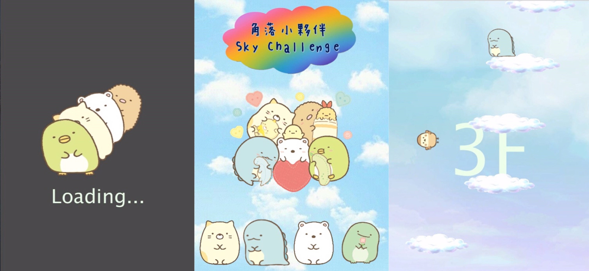

# Sky Challenge

## 展示影片
----

## 遊戲介紹
----
>首先，開啟遊戲時，因為載入音樂會需要花點時間，所以製作了loading的畫面。接下來玩家可依照個人的喜好選擇小夥伴，確定小夥伴後就可以進入到遊戲畫面。遊戲主要是讓玩家透過按鍵模組來操控小夥伴的方向，讓小夥伴跳在每朵雲上。每一層的雲朵長度不一致，並且在第五層時雲朵會隨機移動。另外，左右兩側會隨機出現小麻雀飛過，玩家必需閃躲，碰到小麻雀或從雲朵上掉落下來，遊戲就結束了。玩家必需要讓小夥伴安全的跳在每朵雲上和閃躲小麻雀，考驗玩家的技術和反應。

## 操作:
----
>利用arduino按鍵模組上的"上鍵"、"左鍵"、"右鍵"，來控制小夥伴的方向。

## 特色:
----
>遊戲的設計上，在越高樓層會提高難度與速度，以及增加隨機飛躍的小麻雀，增加遊戲的困難度，讓玩家可以不斷挑戰。介面的設計上，主要以可愛的角落小夥伴當作遊戲主角，並且搭配輕鬆愉快的音樂，增加遊戲整體的豐富度。另外，因為剛開始載入音樂時，會需要花一點時間等待，為了填補這等待的時間，所以增加loading的畫面。